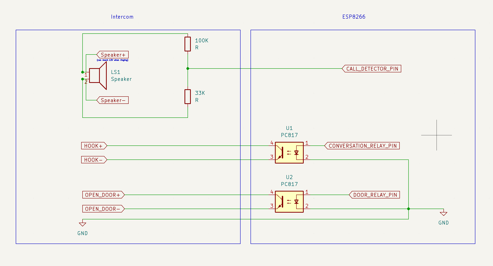

# Pyntercom: A MicroPython Project Powering My Actual Apartment Intercom

## Overview

Pyntercom is a MicroPython project that enables smart functionality for a standard apartment intercom system. It allows you to remotely answer calls and unlock the door using [Home Assistant](https://www.home-assistant.io/)(MQTT communication). The system runs on ESP8266 hardware(or any other MicroPython compatible device) and bridges the gap between your traditional intercom and smart home ecosystem.

## Features

- 📱 Remote intercom call detection
- 🔓 Door unlocking via MQTT commands
- 🔌 Integration with home automation systems
- 🔄 Automatic recovery from WiFi/MQTT disconnections
- 🧪 Built-in test mode for development

## Hardware Requirements

- ESP8266 board (NodeMCU, Wemos D1, etc.)
- Relay module x2 (for controlling door lock and conversation)
- Appropriate power supply
- Connection to intercom system (depends on your specific intercom model)

## Installation

1. Clone this repository:

   ```bash
   git clone https://github.com/mihailacusteanu/pyntercom.git
   cd pyntercom
   ```

2. Create your configuration:

   ```bash
   cp src/config/mock_config.py src/config/esp8266_config.py
   ```

3. Edit `src/config/esp8266_config.py` with your WiFi and MQTT credentials.

4. Flash MicroPython to your ESP8266 board (if not already done):

   ```bash
   # Install required tools
   pip install esptool rshell
   
   # Flash MicroPython firmware
   esptool.py --port /dev/your_port erase_flash
   esptool.py --port /dev/your_port write_flash -fm dio 0 firmware.bin
   ```

5. Deploy the code to your ESP8266 using the provided script:

   ```bash
   ./scripts/deploy.sh your_port
   ```

## Configuration

Configure the system by editing the following in `src/config/esp8266_config.py`:

```python
WIFI_SSID = "your_wifi_ssid"
WIFI_PASSWORD = "your_wifi_password"
MQTT_USERNAME = "your_mqtt_username" 
MQTT_PASSWORD = "your_mqtt_password"
MQTT_CLIENT_ID = "your_client_id"
MQTT_SERVER = "your_mqtt_server"
```

The GPIO pin configurations are defined in `src/config/core.py` and can be modified if needed:

```python
CALL_DETECTOR_PIN = 14
DOOR_RELAY_PIN = 13
CONVERSATION_RELAY_PIN = 12
```

## Usage

Once deployed to the ESP8266, the system will:

1. Connect to your WiFi network
2. Connect to the MQTT broker
3. Listen for incoming intercom calls
4. Publish call detection messages to MQTT topic `pyntercom/intercom/call_detected`
5. Listen for door unlock commands on MQTT topic `pyntercom/intercom/unlock`

### MQTT Topics

- **Publish**: `pyntercom/intercom/call_detected` - Message published when a call is detected
- **Subscribe**: `pyntercom/intercom/unlock` - Send "open" to this topic to unlock the door

### Testing

Test mode is available for development:

```python
intercom = Intercom()
intercom.run(test_mode=True, max_iterations=10)  # Will run for 10 iterations only
```

## Wiring

Connect your ESP8266 to the intercom system as follows:

1. GPIO 14 (D5) - Input for call detection(speaker of the intercom with proper voltage divider)
2. GPIO 13 (D7) - Output for door unlock relay
3. GPIO 12 (D6) - Output for conversation relay

### Schematic

Below is the wiring schematic for connecting the ESP8266 to your intercom system:



## Development

For local development on your computer:

```bash
./scripts/repl.sh
```

You can also clean Python cache files with:

```bash
./scripts/clean.sh
```

This will start a Python REPL with access to the mock drivers.

## License

This project is licensed under the MIT License - see the [LICENSE](LICENSE) file for details.

MIT License permits use, modification, and distribution of this code for both private and commercial purposes, provided the license and copyright notice are included. No warranty is provided.

## Credits

Developed by Mihai Lacusteanu

## Disclaimer

This project involves interfacing with an intercom system and modifying electrical connections. Please ensure you know what you're doing and proceed at your own risk.
